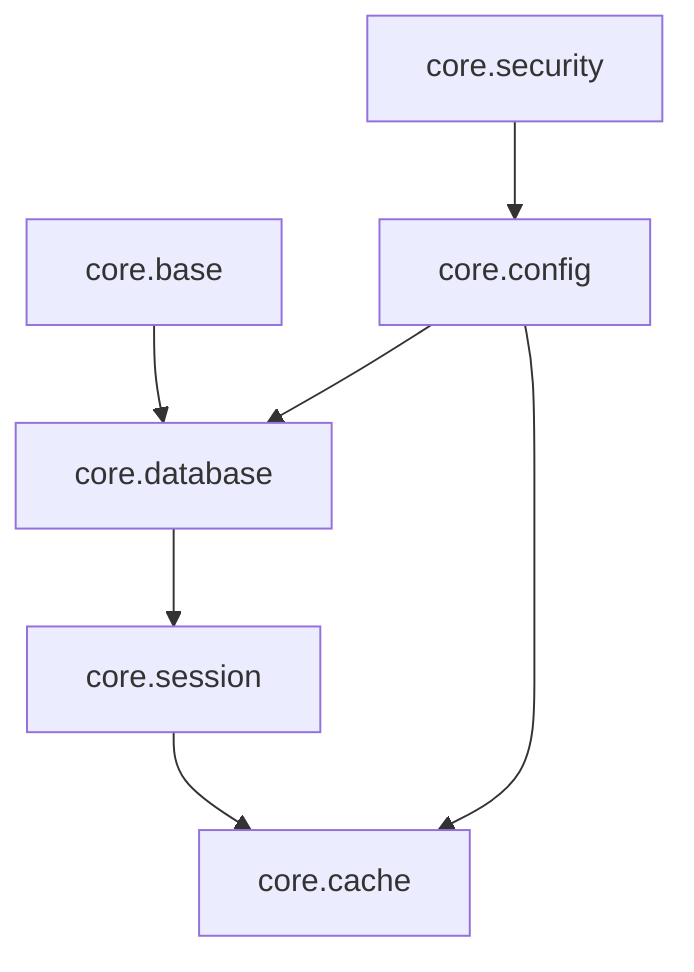
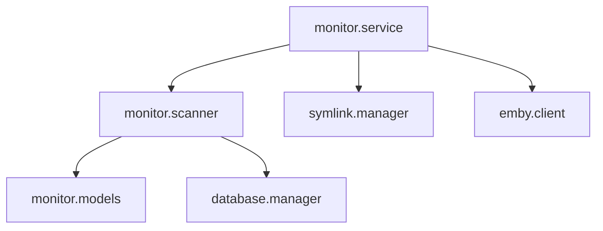
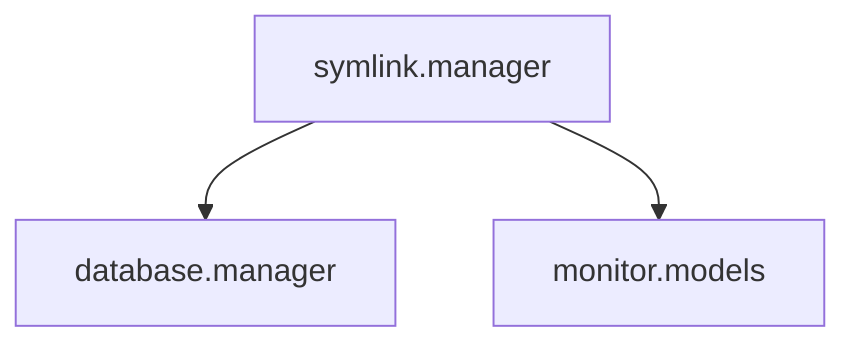
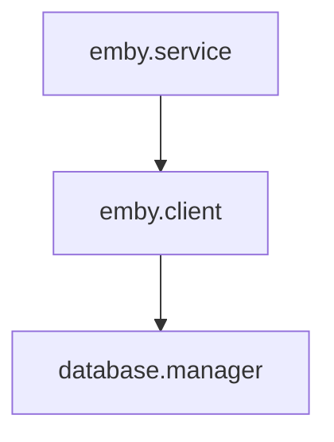

# 模块交互说明

## 核心模块交互

### 1. 基础依赖关系


### 2. 初始化流程
1. 加载配置（config）
2. 初始化数据库（database）
3. 启动会话管理（session）
4. 初始化缓存（cache）
5. 配置安全组件（security）

## 业务模块交互

### 1. Monitor 模块


#### 交互流程
1. `MonitorService` 启动监控
2. `FileScanner` 扫描文件变化
3. 发现变化后：
   - 更新数据库记录
   - 通知 Symlink 模块创建链接
   - 通知 Emby 模块刷新媒体库

### 2. Symlink 模块


#### 交互流程
1. 接收 Monitor 模块的通知
2. 创建或更新符号链接
3. 更新数据库记录
4. 处理文件系统事件

### 3. Emby 模块


#### 交互流程
1. 接收媒体库更新请求
2. 调用 Emby API 刷新媒体库
3. 更新数据库状态
4. 处理刷新结果

## 数据流转

### 1. 文件变更流程
```
Monitor.scanner
    → 检测文件变化
    → 更新数据库记录
    → 通知 Symlink.manager
    → 创建符号链接
    → 通知 Emby.service
    → 刷新媒体库
```

### 2. 数据同步流程
```
Database.manager
    → 处理数据库操作
    → 更新缓存
    → 通知相关模块
    → 更新状态
```

## 事件处理

### 1. 文件事件
- **触发源**: Monitor.scanner
- **处理流**: Monitor → Symlink → Emby
- **数据更新**: Database.manager
- **状态通知**: 所有相关模块

### 2. 媒体库事件
- **触发源**: Emby.client
- **处理流**: Emby → Monitor
- **数据更新**: Database.manager
- **状态通知**: Monitor.service

## 错误处理

### 1. 模块级错误
```python
try:
    await module.operation()
except ModuleError as e:
    logger.error(f"模块操作失败: {str(e)}")
    await handle_module_error(e)
```

### 2. 跨模块错误
```python
try:
    await cross_module_operation()
except (ModuleAError, ModuleBError) as e:
    logger.error(f"跨模块操作失败: {str(e)}")
    await handle_cross_module_error(e)
```

## 性能优化

### 1. 缓存策略
- Monitor 模块缓存文件状态
- Symlink 模块缓存链接信息
- Emby 模块缓存媒体信息

### 2. 批量处理
- 批量扫描文件变化
- 批量创建符号链接
- 批量更新数据库

### 3. 并发控制
- 限制扫描并发数
- 控制数据库连接数
- 管理 API 请求频率

## 监控指标

### 1. 性能指标
- 文件扫描速度
- 符号链接创建时间
- 媒体库刷新延迟
- 数据库操作耗时

### 2. 状态指标
- 活动任务数
- 等待队列长度
- 错误率统计
- 资源使用率

### 3. 业务指标
- 文件变更频率
- 符号链接数量
- 媒体库大小
- 刷新成功率

## 配置管理

### 1. 模块配置
```yaml
monitor:
  scan_interval: 300
  batch_size: 1000

symlink:
  max_retries: 3
  backup_enabled: true

emby:
  refresh_delay: 10
  auto_refresh: true
```

### 2. 交互配置
```yaml
interaction:
  max_concurrent: 5
  retry_interval: 30
  timeout: 60
```

## 开发建议

### 1. 模块开发
- 遵循单一职责原则
- 保持模块独立性
- 提供清晰的接口
- 实现错误处理

### 2. 交互开发
- 使用异步操作
- 实现重试机制
- 添加超时控制
- 记录详细日志

### 3. 测试建议
- 编写单元测试
- 进行集成测试
- 模拟错误场景
- 测试并发情况
``` 